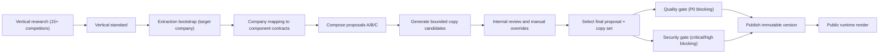

# Vertical Studio v3 - Architecture

## 1. Monorepo Topology
```text
apps/
  api/
  worker/
  cms/
  ops-web/
  public-web/
packages/
  schema/
  component-catalog/
  composition-rules/
  quality/
  security/
docs/
  plan/
  quality/
  security/
```

## 2. Runtime Domains
1. Vertical intelligence domain:
   1. `Vertical Research Engine`
   2. `Vertical Standard Registry`
2. Company delivery domain:
   1. extraction bootstrap
   2. deterministic composition
   3. copy generation and bounded selection
   4. internal approval
   5. publish gates
3. Runtime domain:
   1. immutable snapshots
   2. dynamic public rendering

## 3. Core Components
1. `apps/cms`
   1. owner/editor structured content editing
   2. legal template editing with required blocks
2. `apps/ops-web`
   1. internal admin review surface
   2. variant selection
   3. publish/rollback control
3. `apps/api`
   1. orchestration endpoints
   2. review state transitions
   3. webhook ingestion
4. `apps/worker`
   1. vertical research jobs
   2. composition jobs
   3. quality/security gate jobs
5. `apps/public-web`
   1. subdomain resolution
   2. immutable snapshot rendering

## 4. Orchestration Flow


## 5. Competitor Data Use Policy
Allowed extraction from competitors:
1. IA patterns
2. CTA model patterns
3. trust element patterns
4. tone patterns

Disallowed:
1. direct text reuse
2. design cloning
3. section-by-section replication

## 6. Approval State Machine
Canonical states:
1. `draft`
2. `proposal_generated`
3. `review_in_progress`
4. `proposal_selected`
5. `quality_checking`
6. `security_checking`
7. `publish_blocked`
8. `published`
9. `rollback_pending`
10. `rolled_back`

Allowed transitions:
1. `draft -> proposal_generated`
2. `proposal_generated -> review_in_progress`
3. `review_in_progress -> proposal_selected`
4. `proposal_selected -> quality_checking`
5. `quality_checking -> security_checking`
6. `quality_checking -> publish_blocked`
7. `security_checking -> published`
8. `security_checking -> publish_blocked`
9. `published -> rollback_pending`
10. `rollback_pending -> rolled_back`

Actor constraints:
1. `internal_admin` required for state-changing publish operations.
2. owner/editor cannot force publish transitions.

## 7. Component and Copy Architecture
1. Component contracts are first-class data contracts.
2. Copy slots are contract-bound and length-limited.
3. High-impact slots have 3 candidates and 1 recommended selection.
4. Non-high-impact slots run single pass under hard constraints.

## 8. Storage Model
1. Control-plane metadata in Postgres/Supabase.
2. Publish artifacts in object storage (S3/R2).
3. Optional corpus module:
   1. minimal in v1
   2. not in critical publish path

## 9. Security and Secrets Boundaries
1. Provider-managed secrets only.
2. Application stores references and metadata only.
3. Secret management restricted to `internal_admin`.
4. Security findings must be emitted in JSON + markdown.

## 10. Compatibility Architecture
Existing endpoints remain and are mapped into new intake/orchestration contracts:
1. `/api/v1/generate`
2. `/api/v1/extract`
3. `/api/v1/deploy`
4. `/api/v1/companies`
